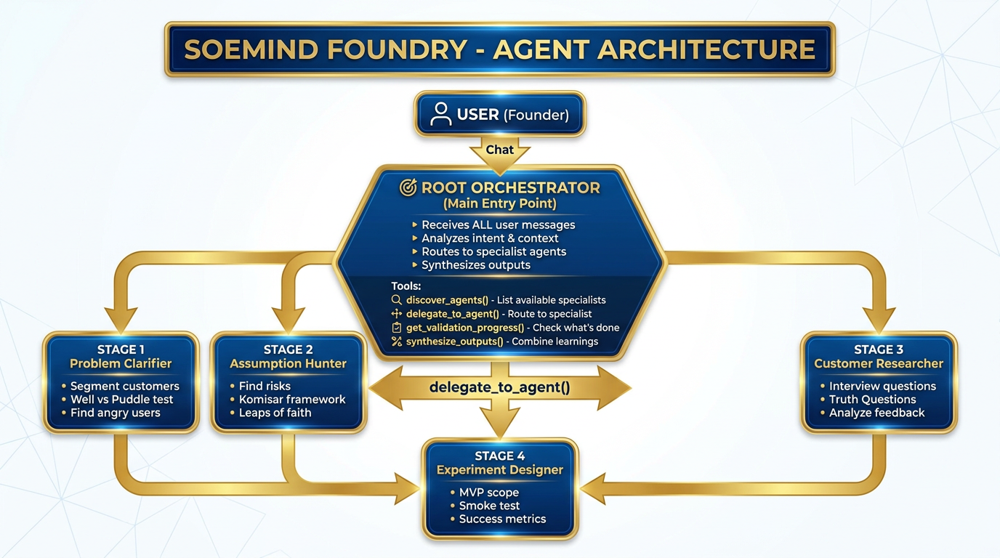

# SoeMind Foundry: Idea Validation Agent

> **Google for Startups AI Agents Challenge - Track 2: Optimize**

An AI-powered multi-agent system that helps early-stage startup founders validate their ideas before building an MVP. Built with Google's Agent Development Kit (ADK) and deployed on Google Cloud.

**Live Demo:** https://founder-validation-agent-356663565224.us-central1.run.app

---

## Problem

Early-stage founders often struggle to validate ideas clearly. In the existing SoeMind Foundry coaching workflow, AI could help founders clarify ideas, but the output needed to become more reliable across real founder scenarios — vague startup ideas, weak assumptions, unclear target users, incomplete evidence, and oversized MVP scopes.

## Solution

SoeMind Foundry: Idea Validation Agent optimizes the existing idea-clarification workflow into a structured validation agent for private-beta founders. The agent guides founders through a repeatable process: clarifying the idea, identifying risky assumptions, generating customer interview questions, narrowing MVP scope, and recommending a focused 7-day validation task.

Built on proven frameworks (Truth Questions, Lean Startup, Design Thinking).

### What It Does

| Capability | Description |
|------------|-------------|
| **Clarify Ideas** | Transform vague ideas into structured problem/solution statements |
| **Hunt Assumptions** | Identify risky assumptions that need testing first |
| **Generate Questions** | Create non-leading customer interview questions |
| **Scope MVPs** | Define the smallest testable product |
| **Create Plans** | Build 7-day validation plans with concrete actions |

---

## Architecture

### Agent Architecture



### System Architecture

```
┌─────────────────────────────────────────────────────────────────────┐
│                         FRONTEND (React)                            │
│                      Cloud Run / localhost:8080                     │
├─────────────────────────────────────────────────────────────────────┤
│  Chat UI  │  Simulation  │  Templates  │  Traces  │  Optimizer     │
└─────────────────────────────────────────────────────────────────────┘
                              │
                              ▼
┌─────────────────────────────────────────────────────────────────────┐
│                    BACKEND (TypeScript/Express)                      │
├─────────────────────────────────────────────────────────────────────┤
│  ADK Agent Runtime  │  Track 2 API  │  Optimizer Engine             │
├─────────────────────────────────────────────────────────────────────┤
│                                                                      │
│  ┌─────────────────────────────────┐  ┌────────────────────────────┐│
│  │        ORCHESTRATOR             │  │   Quality Flywheel         ││
│  │        (Root Agent)             │  │   (Python Scripts)         ││
│  └───────────────┬─────────────────┘  │                            ││
│                  │                    │  • Scenario Generation     ││
│         A2A Protocol                  │  • Gemini-based Evaluation  ││
│                  │                    │  • Loss Cluster Analysis   ││
│    ┌─────────────┼─────────────┐      │  • LLM-based Optimization  ││
│    │             │             │      └────────────────────────────┘│
│    ▼             ▼             ▼                                    │
│ ┌────────┐ ┌──────────┐ ┌──────────┐                               │
│ │Problem │ │Assumption│ │Customer  │                               │
│ │Clarifier│ │ Hunter   │ │Researcher│                               │
│ └────────┘ └──────────┘ └──────────┘                               │
│                  │                                                  │
│                  ▼                                                  │
│           ┌──────────┐                                              │
│           │Experiment│                                              │
│           │ Designer │                                              │
│           └──────────┘                                              │
│                                                                     │
└─────────────────────────────────────────────────────────────────────┘
                              │
                              ▼
                    ┌───────────────┐
                    │  Gemini 2.5   │
                    │    Flash      │
                    │  (Vertex AI)  │
                    └───────────────┘
```

### How this maps to Google's stack

| Layer | What we use | Real or modeled? |
|---|---|---|
| **Agent framework** | Google **ADK** (`@google/adk`) — the orchestrator and all 4 sub-agents are ADK `LlmAgent`s; tools are ADK `FunctionTool`s; runs on `adk web` | ✅ Real ADK |
| **Model** | Gemini 2.5 Flash via **Vertex AI** | ✅ Real |
| **Evaluation** | Two paths: (a) a bundled Gemini judge used in the live UI, and (b) the **real Vertex Gen AI Evaluation Service** via `eval/real_eval.py` (`client.evals.evaluate`) | (a) Gemini · (b) ✅ Real service — see [Evaluation](#evaluation) |
| **Optimization** | LLM-assisted instruction rewriting (Gemini); ADK `SimplePromptOptimizer` scaffolded | LLM rewrite (not GEPA) |
| **Deployment** | Google **Cloud Run** | ✅ Real |

> We are transparent about which steps call Google's managed services vs. which are
> Gemini-powered approximations — see the *Implementation status* sections in
> [docs/GENAI_EVALUATION_SERVICE.md](./docs/GENAI_EVALUATION_SERVICE.md#implementation-status-in-this-project)
> and [docs/OPTIMIZE_AGENT_PROMPTS.md](./docs/OPTIMIZE_AGENT_PROMPTS.md#implementation-status-in-this-project).

### Multi-Agent System

| Agent | Role | Tools |
|-------|------|-------|
| **Orchestrator** | Routes requests, synthesizes outputs | `detect_validation_stage`, `delegate_to_agent`, `synthesize_outputs` |
| **Problem Clarifier** | Structures vague ideas | `clarify_idea` |
| **Assumption Hunter** | Finds risky assumptions | `identify_risky_assumptions` |
| **Customer Researcher** | Generates non-leading interview questions | `generate_interview_questions` |
| **Experiment Designer** | Scopes MVPs & validation plans | `define_mvp_scope`, `create_7day_validation_plan` |

---

## Track 2: Optimize Features

### 1. Agent Simulation

Test the agent against **20 edge-case scenarios** representing difficult founder personas:

| Scenario Type | Example | Difficulty |
|---------------|---------|------------|
| Validation Seeker | "I already decided, just help me build" | Hard |
| Feature Obsessed | "I want AI + dashboards + integrations..." | Medium |
| Vague Customer | "My target is everyone who works" | Easy |
| Analysis Paralysis | "I've researched for 8 months..." | Medium |
| Regulatory Blind | "I'll deal with HIPAA later" | Hard |

**Live Simulation Dashboard:**
- Real-time conversation view (simulated user ↔ agent)
- Turn-by-turn streaming responses
- Live scoring and pass/fail evaluation
- Tool call tracking

### 2. Agent Observability

Full tracing of agent behavior:

- **Trace Viewer**: See every agent decision, tool call, and response
- **Latency Metrics**: Track response times per turn
- **Tool Analytics**: Which tools are called most frequently
- **Session Replay**: Review complete conversation flows

### 3. Agent Optimizer (Quality Flywheel)

**Google-style Quality Flywheel integration** for continuous agent improvement:

```
┌─────────────────────────────────────────────────────────────┐
│                    QUALITY FLYWHEEL                          │
│                                                              │
│  ┌─────────────┐    ┌─────────────┐    ┌─────────────┐      │
│  │   Step 1    │───▶│   Step 2    │───▶│   Step 3    │      │
│  │  Generate   │    │    Run      │    │  Compute    │      │
│  │  Scenarios  │    │ Inference   │    │  Metrics    │      │
│  └─────────────┘    └─────────────┘    └─────────────┘      │
│                                               │              │
│                                               ▼              │
│  ┌─────────────┐    ┌─────────────┐    ┌─────────────┐      │
│  │   Step 5    │◀───│   Step 4    │◀───│   Loss      │      │
│  │  Optimize   │    │   Analyze   │    │  Clusters   │      │
│  │   (LLM)     │    │  Failures   │    │             │      │
│  └─────────────┘    └─────────────┘    └─────────────┘      │
└─────────────────────────────────────────────────────────────┘
```

**Three Optimization Methods:**

| Method | Speed | Quality | Description |
|--------|-------|---------|-------------|
| **Built-in** | Fast (~5s) | Good | Pattern matching + Gemini rewrite |
| **Google ADK** | Medium (~30s) | Better | ADK `SimplePromptOptimizer` scaffold (Gemini-driven rewrite today) |
| **Quality Flywheel** | Slow (~2-5min) | Best | 5-step workflow modeled on Google's Agent Platform |

> **Implementation note:** "Optimization" today is **LLM-assisted instruction rewriting**
> (Gemini), not Google's GEPA algorithm. Evaluation scores can be produced either by the
> bundled Gemini judge or, via `eval/real_eval.py`, by the **real Vertex Gen AI Evaluation
> Service** (`client.evals.evaluate`). See
> [docs/OPTIMIZE_AGENT_PROMPTS.md](./docs/OPTIMIZE_AGENT_PROMPTS.md#implementation-status-in-this-project).

**Features:**
- **Failure Pattern Detection**: Automatically identifies issues (hallucination, instruction following, tool calling)
- **A/B Testing**: Side-by-side comparison of instruction versions with per-scenario scores
- **Version History**: Track all prompt changes with rollback capability
- **Loss Cluster Analysis**: Groups failures by semantic category

### 4. A/B Testing

Compare instruction versions with real Gemini evaluation:

- Select any two versions to compare
- Tests against 5 edge-case scenarios
- Shows side-by-side scores per scenario
- Displays generated responses for comparison
- One-click to apply the winner

### 5. Dynamic Prompt Templates

Template system with `{{variable:default}}` syntax:

```
// Scenario Template
I've already decided to build {{product:a social network}}.
{{extra_context}}Don't try to change my mind.

// Agent Instruction Template
You are the {{agent_name:SoeMind Foundry Orchestrator}}.
Your validation_depth is {{depth:thorough}}.
```

---

## Evaluation

Track 2 is about measuring and improving agent quality. We support **two evaluation paths**,
and we are explicit about which is which:

| Path | What it is | Use |
|---|---|---|
| **Live UI judge** | A Gemini-based rater wired into the Simulation / A/B dashboards | Fast, in-app scoring during the demo |
| **Real Vertex eval** | The genuine **Gen AI Evaluation Service** (`client.evals.evaluate` with adaptive `RubricMetric`s) | Authoritative, reproducible scores |

### Run the real Vertex evaluation locally (no cloud hosting required)

The agent runs locally via ADK; only the eval *service* is called as an API.

```bash
# 0. one-time auth (the eval service + Vertex model need ADC)
gcloud auth application-default login

# 1. start the local ADK agent (terminal 1)
PORT=8101 npx adk web --port 8101

# 2. collect real (prompt, response, tool-trajectory) runs (terminal 2)
AGENT_BASE_URL=http://localhost:8101 python3 eval/collect_agent_runs.py

# 3. score them with the real Gen AI Evaluation Service
python3 eval/real_eval.py        # writes eval/results/real_eval_<ts>.json
```

`eval/collect_agent_runs.py` drives the agent over the local ADK server; `eval/real_eval.py`
calls `client.evals.evaluate(dataset=df, metrics=[RubricMetric.GENERAL_QUALITY, ...])`,
faithful to Google's [official quick-start notebook](docs/notebooks/quick_start_gen_ai_eval.ipynb).

> Multi-turn agent raters and loss-cluster analysis are **Preview** features of the Agent
> Platform and may require allowlisting on your project; the single-turn rubric path above is
> generally available.

---

## Tech Stack

| Component | Technology |
|-----------|------------|
| **Agent Framework** | Google Agent Development Kit (ADK) — `@google/adk` (`LlmAgent`, `FunctionTool`) |
| **LLM** | Gemini 2.5 Flash (Vertex AI) |
| **Runtime** | Node.js 22 + TypeScript |
| **Frontend** | React 18 + Vite + Tailwind CSS |
| **Backend** | Express.js |
| **Storage** | Google Cloud Storage (JSON persistence) |
| **Evaluation** | Vertex AI Evaluation API + Agent Platform simulation approach |
| **Deployment** | Google Cloud Run |
| **Protocol** | A2A (Agent-to-Agent) |

### Data Sources

- Founder profile data and startup idea descriptions
- MVP scope and customer interview notes
- Validation evidence and blocker logs
- Synthetic founder scenarios for testing
- Internal SoeMind Foundry coaching frameworks

---

## Quick Start

### Prerequisites

- Node.js 22+
- Python 3.10+ (for Quality Flywheel)
- Google Cloud account with Vertex AI enabled
- API key configured

### Installation

```bash
# Clone the repository
git clone <repo-url>
cd founder-validate-agent

# Install Node.js dependencies
npm install
cd frontend && npm install && cd ..

# Install Python dependencies (for evaluation + optimizer)
pip install "google-cloud-aiplatform[adk,evaluation]" google-genai python-dotenv

# Configure environment
cp .env.example .env
# then edit .env — set GOOGLE_CLOUD_PROJECT, keep GOOGLE_GENAI_USE_VERTEXAI=1
# (Vertex mode), and run: gcloud auth application-default login
```

### Running Locally

```bash
# One command (starts backend/agent on 8101 + frontend on 8100):
./start.sh

# Or manually:
PORT=8101 npx adk web --port 8101      # ADK agent runtime
npm run dev                            # frontend (8100)
```

### Access

| URL | Description |
|-----|-------------|
| http://localhost:8100 | Main UI (Chat, Simulation, Templates, Optimizer) |
| http://localhost:8100/track2 | Track 2 Optimizer Dashboard |
| http://localhost:8101 | ADK agent runtime (`adk web`) |

> On Cloud Run the app is served on port **8080**; locally it's **8100** (UI) / **8101** (agent).

---

## Deployment

### Deploy to Cloud Run

```bash
# Build
npm run build
cd frontend && npm run build && cd ..

# Deploy
gcloud run deploy founder-validation-agent \
  --source . \
  --region us-central1 \
  --allow-unauthenticated \
  --memory 2Gi \
  --timeout 300
```

---

## Project Structure

```
vertexai-agent-evaluation/
├── src/
│   ├── agent.ts                      # Root orchestrator (ADK LlmAgent)
│   ├── agents/
│   │   ├── problem-clarifier.ts
│   │   ├── assumption-hunter.ts
│   │   ├── customer-researcher.ts
│   │   ├── experiment-designer.ts
│   │   ├── agent-templates.ts        # Agent instruction templates
│   │   └── index.ts                  # Agent registry + A2A cards
│   ├── tools/                        # ADK FunctionTools (one per file)
│   │   ├── clarify-idea.tool.ts
│   │   ├── identify-assumptions.tool.ts
│   │   ├── interview-questions.tool.ts
│   │   ├── mvp-scope.tool.ts
│   │   ├── validation-plan.tool.ts
│   │   └── index.ts
│   ├── simulation/
│   │   ├── simulator.ts              # Simulation engine
│   │   ├── edge-cases.ts             # 20 test scenarios
│   │   └── templates.ts              # Prompt templates
│   ├── optimizer/
│   │   └── optimizer.ts              # Optimization engine (Built-in, ADK, Flywheel)
│   ├── evaluation/
│   │   └── vertex-evaluation.ts      # Gemini-based judge (live UI scoring)
│   ├── api/
│   │   ├── server.ts                 # Express API server
│   │   ├── track2-api.ts             # Track 2 endpoints
│   │   └── streaming-simulation.ts
│   ├── observability/
│   │   ├── cloud-trace.ts            # Cloud Trace integration
│   │   ├── tracing.ts
│   │   └── vertex-trace.ts
│   ├── middleware/guardrails.ts      # Input/output guardrails
│   ├── security/secrets.ts           # Secret Manager integration
│   └── gemini/                        # Cost calculator + model benchmark
├── eval/
│   ├── collect_agent_runs.py         # Drive local ADK agent → agent_runs.jsonl
│   ├── real_eval.py                  # REAL Vertex eval (client.evals.evaluate)
│   ├── vertex_eval.py                # Full Vertex eval pipeline (SDK)
│   ├── run_eval.py                   # Local HTTP eval harness
│   ├── eval_cases.json / eval_dataset.json
├── scripts/
│   ├── vertex_evaluation.py          # Quality Flywheel (Gemini-based today)
│   └── adk_optimizer.py              # ADK SimplePromptOptimizer scaffold
├── frontend/
│   └── src/
│       ├── App.jsx
│       └── components/track2/
│           ├── Track2Dashboard.jsx
│           ├── SimulationDashboard.jsx
│           ├── DualLiveSimulation.jsx
│           ├── AgentArchitecture.jsx
│           ├── TemplateEditor.jsx
│           ├── AgentTemplateEditor.jsx
│           ├── TraceViewer.jsx
│           └── OptimizerDashboard.jsx
├── docs/                             # Reference docs + Vertex eval notebooks
│   ├── README.md                     # Documentation index
│   ├── CHALLENGE_RESOURCE_GUIDE.md   # Hackathon tracks / judging criteria
│   ├── OPTIMIZER_SYSTEM.md / API_REFERENCE.md / QUICKSTART.md
│   ├── GENAI_EVALUATION_SERVICE.md … ONLINE_MONITORS.md   # Agent Platform refs
│   └── notebooks/                    # 41 official Vertex eval notebooks
├── adk-js/                           # Google ADK source (local reference, git-ignored; see NOTICE)
├── TRACK2_IMPLEMENTATION_CHECKLIST.md
├── SUBMISSION_TODO.md
├── NOTICE                            # Third-party attribution
└── package.json
```

---

## API Endpoints

### Simulation

| Endpoint | Method | Description |
|----------|--------|-------------|
| `/api/simulation/scenarios` | GET | List all test scenarios |
| `/api/simulation/run` | POST | Run single scenario |
| `/api/simulation/run-stream` | POST | Run with SSE streaming |
| `/api/simulation/run-all-stream` | POST | Run all with streaming |

### Optimizer

| Endpoint | Method | Description |
|----------|--------|-------------|
| `/api/optimizer/analyze` | POST | Analyze failure patterns |
| `/api/optimizer/generate-fix` | POST | Generate optimized instruction |
| `/api/optimizer/ab-test` | POST | Run A/B test between versions |
| `/api/optimizer/versions` | GET | List instruction versions |
| `/api/optimizer/versions/:id/apply` | POST | Apply version to agent |

### Templates

| Endpoint | Method | Description |
|----------|--------|-------------|
| `/api/templates` | GET | List scenario templates |
| `/api/templates/:id` | PUT | Update template |
| `/api/agent-templates` | GET | List agent instruction templates |
| `/api/agent-templates/:id` | PUT | Update agent instruction |
| `/api/agent-templates/:id/reset` | POST | Reset to default |

### Observability

| Endpoint | Method | Description |
|----------|--------|-------------|
| `/api/observability/traces/:sessionId` | GET | Get session traces |
| `/api/observability/analytics` | GET | Get analytics summary |

---

## Documentation

See the `/docs` folder for detailed documentation:

- [Quick Start Guide](docs/QUICKSTART.md)
- [Optimizer System Architecture](docs/OPTIMIZER_SYSTEM.md)
- [API Reference](docs/API_REFERENCE.md)

---

## Frameworks Used

Built on proven methodologies:

- **Truth Questions** (Rob Fitzpatrick) - Customer conversation rules
- **Lean Startup** (Eric Ries) - Leap-of-faith hypotheses
- **Inspired** (Marty Cagan) - Opportunity assessment
- **Lean Product Playbook** (Dan Olsen) - MVP scoping
- **YC Startup Library** - The 6 core questions
- **Google Quality Flywheel** - Agent evaluation & optimization

---

## Findings and Learnings

The biggest learning is that founders do not only need AI answers — they need **structured decision support** that remains reliable across different startup contexts.

During optimization, the agent became more useful when its output was evaluated against specific quality criteria:
- Whether assumptions are **specific and testable**
- Whether interview questions are **not leading**
- Whether MVP scope is **small enough**
- Whether the next action is **realistic**

This helped move the agent from broad coaching advice toward **evidence-based founder action**.

### Optimizer Challenge

The optimizer generates instruction improvements based on failure patterns, but in testing, improved versions sometimes scored lower than the original. This reveals a key challenge: **optimizing for specific failure cases can degrade overall performance**. Future work would focus on regression testing — ensuring fixes don't break existing passing scenarios.

### Most Useful Vertex AI Feature

**Vertex AI Evaluation API** — Automated pass/fail scoring on evaluation datasets. Instead of manually reviewing responses, we define pass criteria and let the API score each response on multiple dimensions: coherence, groundedness, safety, and task fulfillment.

### What's Missing

**Built-in evaluation callbacks that expose agent reasoning and tool selection rationale.** Currently, understanding *why* the agent chose a specific tool requires building a separate LLM analysis layer. Structured reasoning traces would make debugging instant instead of investigative.

---

## Key Design Decisions

1. **Multi-Agent Architecture** - Specialized agents for each validation phase
2. **A2A Protocol** - Standard communication between agents
3. **Evidence-Based** - Push founders toward real user evidence
4. **Minimal MVPs** - Aggressively scope down to ONE feature
5. **Time-Boxed** - 7-day validation cycles with clear decision points
6. **Honest Feedback** - Challenge weak ideas respectfully
7. **Continuous Optimization** - Quality Flywheel for ongoing improvement

---

## Team

**SoeMind Foundry**

---

## License

Licensed under the **Apache License 2.0** — see [LICENSE](./LICENSE).

This project is built on Google's **Agent Development Kit (ADK)** (`@google/adk`,
Apache-2.0) and the Vertex AI / Gemini Agent Platform SDKs. Third-party components retain
their own licenses; see [NOTICE](./NOTICE) for attribution.
